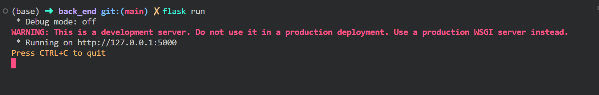

# Didi-Da-Rice 

# 开发环境配置 <WSL+VScode>
## 主项目初始化 
### 克隆项目文件
``` bash
git clone https://github.com/OzzyHelium/Didi-Da-Rice.git 
``` 
### 安装与更新项目所需环境 
``` bash 
sudo apt update
# 安装npm
sudo apt-get install npm
sudo npm install
# 清除npm缓存
sudo npm cache clean -f 
# 安装n, Node的版本管理器
sudo npm install -g n
# 安装了n模块后，使用它来安装最新的稳定版本
sudo n stable
# 安装后端所需环境
pip3 install Flask
pip3 install Flask_CORS
``` 

## 运行后端
``` bash
cd back_end
flask run
```
运行结果如图 


``` bash 
# 访问后端
curl http://127.0.0.1:5000/
# 收到回复
Hello World!%

# 发送post请求
curl -d''-X POST http://127.0.0.1:5000/api/post
# 收到回复
{"message":"Success"}
```
访问浏览器 


## 运行前端 
### s
在开发阶段运行
```sh
# Compile and Hot-Reload for Development
cd front_end
sudo npm run dev
``` 

在部署阶段运行
```sh
# Compile and Minify for Production
cd front_end
sudo npm run build
```
