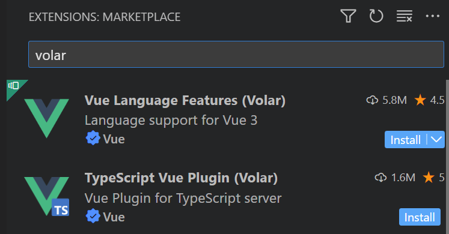

# front_end

This template should help get you started developing with Vue 3 in Vite.

## Recommended IDE Setup

[VSCode](https://code.visualstudio.com/) + [Volar](https://marketplace.visualstudio.com/items?itemName=Vue.volar) (and disable Vetur) + [TypeScript Vue Plugin (Volar)](https://marketplace.visualstudio.com/items?itemName=Vue.vscode-typescript-vue-plugin).

## Customize configuration

See [Vite Configuration Reference](https://vitejs.dev/config/).

## Project Setup

If you work in wsl, you need

And
```sh
sudo apt-get install npm
sudo npm install
sudo npm cache clean -f # 清除npm缓存
sudo npm install -g n   # 安装n, Node的版本管理器
sudo n stable    # 安装了n模块后，使用它来安装最新的稳定版本
sudo n latest # 如果你想安装最新版本
```

### Compile and Hot-Reload for Development

```sh
npm run dev
```

### Compile and Minify for Production

```sh
npm run build
```
